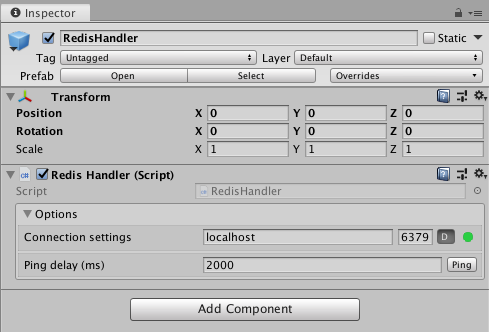
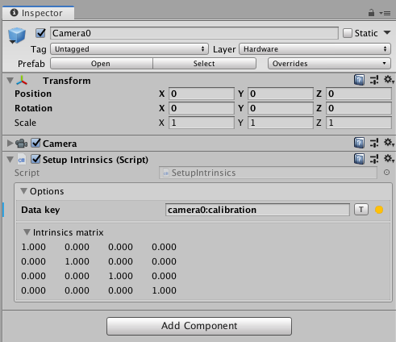
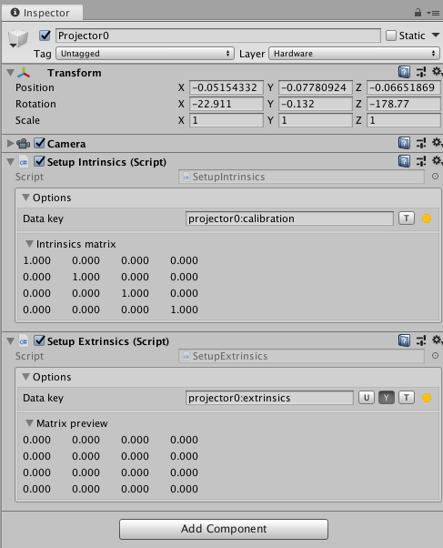
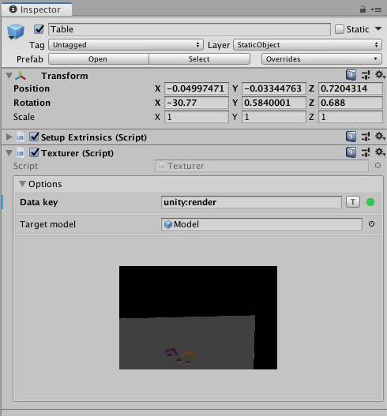
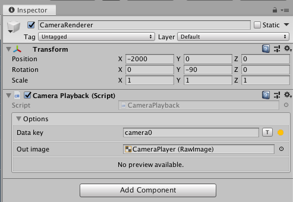

# **Natar Unity**
---

### Détail des scripts
- **RedisHandler**:\
  Script de base permettant d'établir la connection avec un serveur Redis (local ou distant). Ce composant est **unique** et ne doit être ajouté qu'une unique fois dans la scène. Il implémente le design pattern du singleton qui assure cette unicité.\
  \
  Le boutton **D** de l'inspecteur est activé par défault et permet d'utiliser les sockets sans delay du plugin Redis.\
  Le boutton **Ping** permet de tester si la configuration actuelle est fonctionnelle en envoyant une requête ping sur l'ip ainsi que le port spécifié dans les champs prévues.\
  L'indicateur coloré (à droite du champ de texte) indique l'état du composant: fonctionnel, connecté et  déconnecté. Il est présent dans tout les scripts ayant besoin d'une connection à Redis.\
  **Note**: Chaque composant à access a une instante du RedisHandler qui gère pour ce dernier la connection. Si le RedisHandler est déconnecté tous les composants le sont aussi automatiquement.

- **SetupIntrinsics**:\
  Script de base permettant d'appliqué aux objets tels que des caméras où des projecteurs des paramètres intrinsèques.\
  \
  Le script contient un champ permettant de rentrer la clef dans laquelle sont contenus les paramètres intrinsèques que l'on souhaite récupéré et un boutton **T** pour tester si cette clef contient effectivement des paramètres intrinsèques exploitables.

- **SetupExtrinsics**:\
  Script de base permettant d'appliqué a n'importe quel objet des paramètres extrinsèques.\
  \
  Le script contient un champ permettant de rentrer la clef dans laquelle sont contenus les paramètres extrinsèques que l'on souhaite récupéré ainsi que plusieurs bouttons:
  - Un boutton **U** (pour update) qui permet de demandé au script de mettre à jour les paramètres extrinsèques du composant à chaque nouvelle frame. Ceci est utile lorsqu'un élément est suivi via n'importe quel tracker Natar et que de ce fait sa transformation (position, rotation) doit constamment être mise à jour.
  - Un boutton **Y** (pour Reverse Y Axis) qui permet d'inversé l'axe Y de la matrice extrinsèques reçues.
  - Un boutton **T** pour tester si cette clef contient effectivement des paramètres extrinsèques exploitables.

- **Texturer**:\
  Script permettant d'appliquer une texture récupérée depuis Redis a un objet de la scène 3D. (Utilisé pour texturer la table par exemple).\
  \
  Le script contient un champ pour la clef ainsi qu'un boutton de test, champ pour glisser le model auquel on souhaite appliquer la texture récupérée, ainsi qu'un champ pour visualiser cette dernière.

- **CameraPlayback**:\
  Script permettant d'obtenir le flux vidéo de la caméra physique.\
  \
  Le script contient un champ pour la clef, un boutton de test, un champ permettant de spécifié un composant RawImage dans lequel écrire le flux pour y avoir acces plus tard et un champ de visualisation de ce flux vidéo.
  La RawImage sert a composé la vue AR en superposant la RawImage du flux vidéo (vue de la caméra physique) avec le rendue de la scène (vue de la caméra fictive)

### Composants

Cette liste de script est ensuite utilisée dans des composants cruciaux du système:

- **RedisHandler**:\
  Composant contenant le script de connection au serveur Redis.
- **Camera0**:\
  Composant représentant la caméra principale du système.
- **CameraRenderer**:\
  Composant permettant de faire le rendu en vue SeeThrough de l'application developpée (Superposition de la vue caméra physique et de la vue caméra virtuelle)
- **Projector0**:\
  Composant représentant le projecteur principal du système.
- **ProjectorRenderer**:\
  Composant permettant de faire le rendu en vue Projection de l'application developpée (Scène 3D sur fond noir pret pour la projection).
- **Table**:\
  Composant représentant la table physique et pouvant servir de base aux augmentations.
- **Sheet**:\
  Composant représentant une feuille de papier suivi dans le système pouvant servir de base aux augmentations.
- **User (WIP)**:\
  Composant représentant un utilisateur suivi dans le système par la caméra frontale et permettant d'acceder a son point de vue et ainsi créer des illusions de projection.
