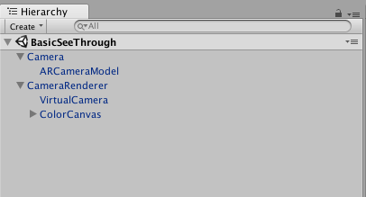

# NectarUnityPlugin

## Prerequisites
- [Unity](https://unity3d.com/fr)
- [Redis](https://redis.io/)

## VSCode for Unity
[Configuration steps](https://gist.github.com/nicpalard/9fc8ce61a17dc5518bea11d79efdefb2)

## Get started

In this quick guide you will learn to create basic scene setups and you will have a quick overview of what this plugin can do and how does it work.

### Basic see through application setup 

- Create a new Unity project and import this project folder. Doing this will create a new scene. 

.
  
- **Remove** the main camera from the created scene.
- To create a see through application you only need 2 components :
    - An **AR Camera** that will be the main camera.
    - An **AR Camera Render** that will show AR Elements on top of the real world.
  
- Place the **Camera** prefab and the **Camera Renderer** prefab in the scene.

- Since this plugins only works with Nectar services, you will need to have Nectar running on your computer with **at least one camera**.

- Configure the **Quick Camera Setup** in the **Camera** component with the camera key you provided when you started Nectar. \
In this example my camera is an **RGB** Camera, where its intrinsics parameters are stored at the following key : **camera0:calibration** and its video data are output to **camera0**. I setup it like so: 

**Note:** The **Internal State** field shows if the camera was setup correctly.
    - **WORKING**  The plugin successfully connected to Nectar and successfully camera intrinsics parameters.
    - **CONNECTED** The plugin successfully connected to Nectar but failed to initiliaze camera intrinsics parameters
    - **DISCONNECTED** The plugin failed to connect to Nectar.
  
- Once this is done, the last step is to go into the CameraPlayer gameobject in:
    - Hierarchy
        - Scene
            - CameraRenderer
                - ColorCanvas
                    - CameraPlayer 
 
and **adding** to the **Camera Video Player** component the **Camera** you just setup up in the associated field.

.

Do not mind the **Debug Markers** public field. It is used to show debug informations about markers detection if Nectar Marker detection service is running.

- The setup is over and if everything was done correctly you should now see the camera output in the canvas.

You can now add AR elements to your See through view by putting them in the scene.

**Since camera intrinsics parameters are setup, 1 Unity units matches 1mm in real world.**